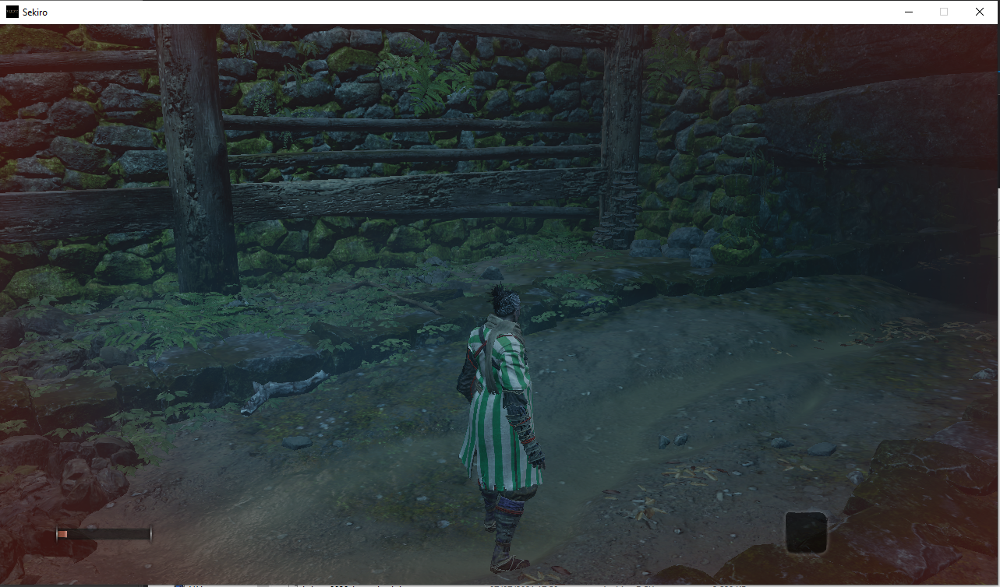

# Sekiro Betis Skin Mod

This mod allow you to play as Betis Sekiro with some modified textures.

## Requirements:

- Sekiro Mod Engine

## Usage

- Place the parts folder (or its contents if you have some extra mod) into `mods/` folder within Sekiro installation directory (i.e. `C:\SteamLibrary\steamapps\common\Sekiro\mods`)
